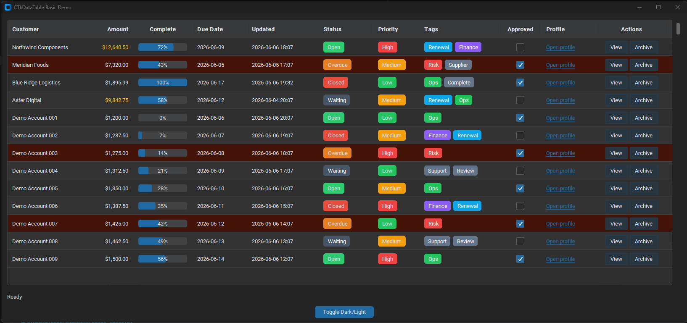
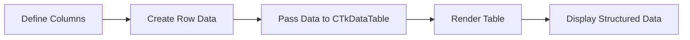

<div align="center">


<br>

<p>
  
</p>

<p>
  <a href="https://pypi.org/project/CTkDataTable/">
    
  </a>
  <a href="https://pypi.org/project/CTkDataTable/">
    
  </a>
  
  
</p>

</div>

---

## What is CTkDataTable?

`CTkDataTable` is a Python module for building cleaner, more practical data tables inside `customtkinter` desktop applications.

It was created to solve a common problem: CustomTkinter is great for modern desktop interfaces, but displaying structured table data can still be awkward. Standard Tkinter options such as `ttk.Treeview` often feel dated, difficult to style, or out of place in a modern UI.

`CTkDataTable` provides a configurable table widget designed for internal tools, dashboards, admin panels, database applications and workflow software.

---

## Preview

<div align="center">




---

## Why Use It?

<table>
  <tr>
    <td width="33%">
      <h3>CustomTkinter Friendly</h3>
      <p>Designed to fit naturally into modern CustomTkinter applications.</p>
    </td>
    <td width="33%">
      <h3>Dictionary Based</h3>
      <p>Define columns and rows using simple Python dictionaries.</p>
    </td>
    <td width="33%">
      <h3>Practical</h3>
      <p>Built for dashboards, admin tools, database viewers and internal systems.</p>
    </td>
  </tr>
</table>

---

## Features

* Built for `customtkinter`
* Simple column configuration
* Row data passed as dictionaries
* Configurable column titles
* Configurable column widths
* Text columns
* Number columns
* Badge columns
* Cleaner alternative to `ttk.Treeview`
* Useful for desktop dashboards and database-driven apps

---

## Installation

```bash
pip install CTkDataTable
```

---

## Quick Start

```python
import customtkinter as ctk
from CTkDataTable import CTkDataTable

app = ctk.CTk()
app.title("CTkDataTable Example")
app.geometry("900x500")

columns = [
    {
        "key": "id",
        "title": "ID",
        "width": 50,
        "type": "number"
    },
    {
        "key": "first_name",
        "title": "First Name",
        "width": 140,
        "type": "text"
    },
    {
        "key": "last_name",
        "title": "Last Name",
        "width": 140,
        "type": "text"
    },
    {
        "key": "position",
        "title": "Position",
        "width": 180,
        "type": "text"
    },
    {
        "key": "permission",
        "title": "Permission",
        "width": 140,
        "type": "badge",
        "badge_colors": {
            "Admin": "red",
            "Manager": "blue",
            "Standard": "gray"
        }
    }
]

rows = [
    {
        "id": 1,
        "first_name": "Harry",
        "last_name": "Gomm",
        "position": "Manager",
        "permission": "Manager"
    },
    {
        "id": 2,
        "first_name": "Ben",
        "last_name": "Jones",
        "position": "Engineer",
        "permission": "Standard"
    },
    {
        "id": 3,
        "first_name": "Charlie",
        "last_name": "Smith",
        "position": "Admin",
        "permission": "Admin"
    }
]

table = CTkDataTable(
    master=app,
    columns=columns,
    rows=rows
)

table.pack(fill="both", expand=True, padx=20, pady=20)

app.mainloop()
```

---

## How It Works



---

## Column Configuration

Columns are defined using dictionaries.

```python
columns = [
    {
        "key": "first_name",
        "title": "First Name",
        "width": 140,
        "type": "text"
    }
]
```

| Property | Description                              |
| -------- | ---------------------------------------- |
| `key`    | The key used to match data from each row |
| `title`  | The text displayed in the table header   |
| `width`  | The width of the column                  |
| `type`   | The column display type                  |

---

## Supported Column Types

<table>
  <tr>
    <td width="33%">
      <h3>Text</h3>
      <p>For names, labels, descriptions and general values.</p>
    </td>
    <td width="33%">
      <h3>Number</h3>
      <p>For IDs, counts, quantities and numeric data.</p>
    </td>
    <td width="33%">
      <h3>Badge</h3>
      <p>For statuses, permissions, categories and priority labels.</p>
    </td>
  </tr>
</table>

### Text Column

```python
{
    "key": "name",
    "title": "Name",
    "width": 160,
    "type": "text"
}
```

### Number Column

```python
{
    "key": "id",
    "title": "ID",
    "width": 60,
    "type": "number"
}
```

### Badge Column

```python
{
    "key": "permission",
    "title": "Permission",
    "width": 140,
    "type": "badge",
    "badge_colors": {
        "Admin": "red",
        "Manager": "blue",
        "Standard": "gray"
    }
}
```

---

## Row Data

Rows are passed as a list of dictionaries.

```python
rows = [
    {
        "id": 1,
        "first_name": "Harry",
        "last_name": "Gomm",
        "position": "Manager",
        "permission": "Manager"
    }
]
```

Each row key should match the `key` value defined in the column configuration.

---

## Use Cases

`CTkDataTable` can be used for:

* Admin panels
* User management screens
* Database viewers
* Desktop dashboards
* CRUD applications
* Job management tools
* NCR tracking systems
* Stock or asset registers
* Reporting interfaces
* Internal business systems

---

## Example Project Structure

```text
your-project/
├── app.py
├── assets/
│   ├── ctkdatatable-preview.png
│   └── ctkdatatable-badges-preview.png
├── database/
│   └── database.py
└── README.md
```

---

## Roadmap

Planned improvements may include:

* Column sorting
* Searching and filtering
* Row selection
* Action buttons
* Pagination
* Editable cells
* Custom themes
* Improved scrollbars
* More column types
* More documentation examples

---

## Project Status

`CTkDataTable` is currently in development.

It is being improved through practical use in real CustomTkinter desktop application projects. Feedback, issues and suggestions are welcome.

---

## Contributing

Contributions are welcome.

If you find a bug, have an idea for a feature, or want to improve the documentation, feel free to open an issue or submit a pull request.

---

## Licence

This project is released under the MIT Licence.

---

## Links

<p>
  <a href="https://pypi.org/project/CTkDataTable/">
    
  </a>
  <a href="https://github.com/Harry-g25/CTkDataTable">
    
  </a>
  <a href="https://www.harrygomm.co.uk">
    
  </a>
</p>

---

<div align="center">

### Built for clean, practical CustomTkinter applications.


</div>
